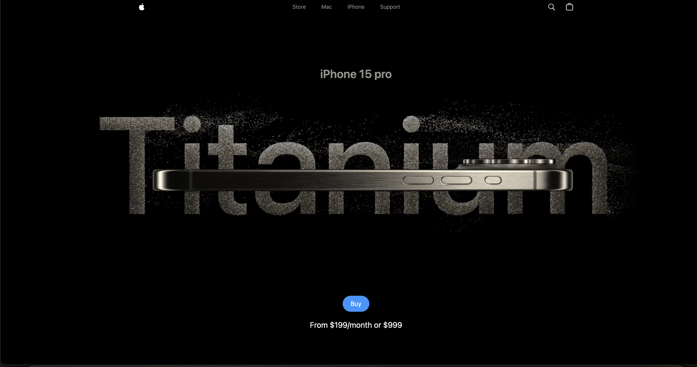
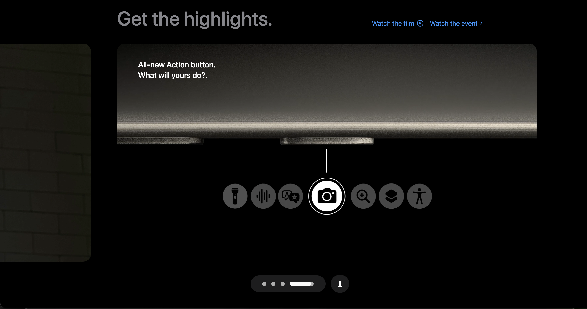

# Apple Website Clone

This project is a clone of the Apple website, recreated to demonstrate the capabilities of modern web technologies. It's built using React.js with Vite, and features rich animations and 3D models powered by Three.js and GSAP.

## Features

- **Three.js**: Realistic 3D models and animations that mimic the look and feel of Apple's original website.
- **GSAP**: Smooth and performant page transitions and interactive animations.
- **React.js**: A component-based architecture for building user interfaces with efficiency and flexibility.
- **Vite**: An ultra-fast build tool that provides a smooth developer experience.

## Live Demo

You can view the live demo of the project here. (https://poojan-2099.github.io/Apple_clone/)

